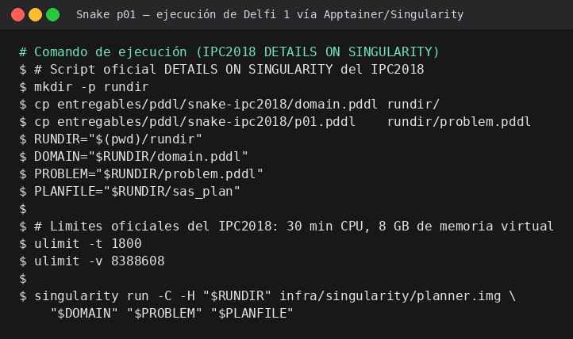
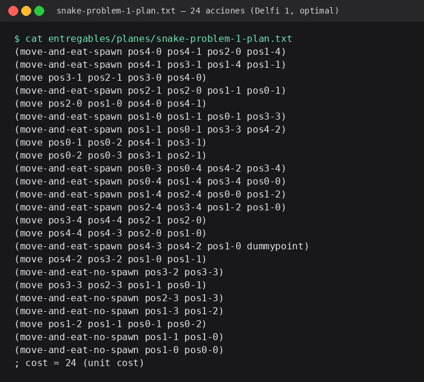
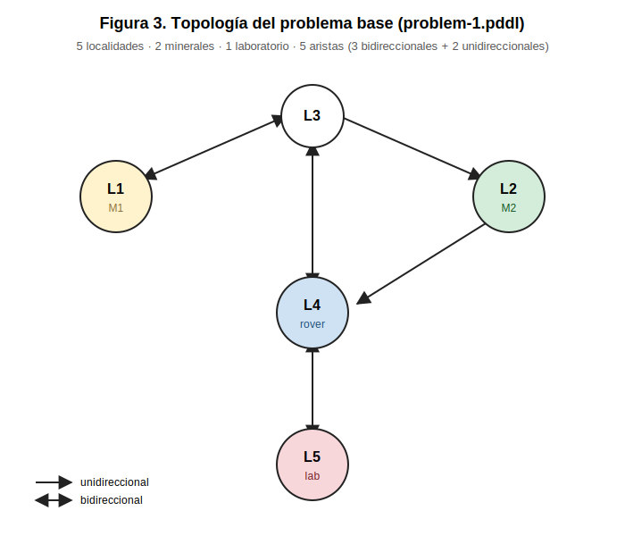
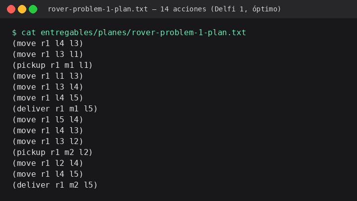
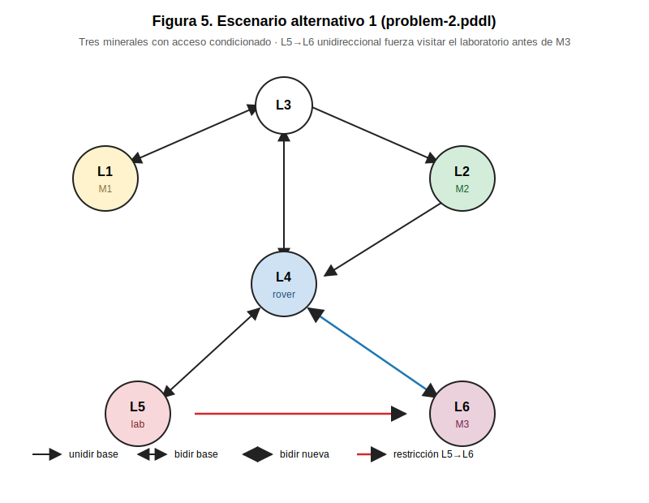
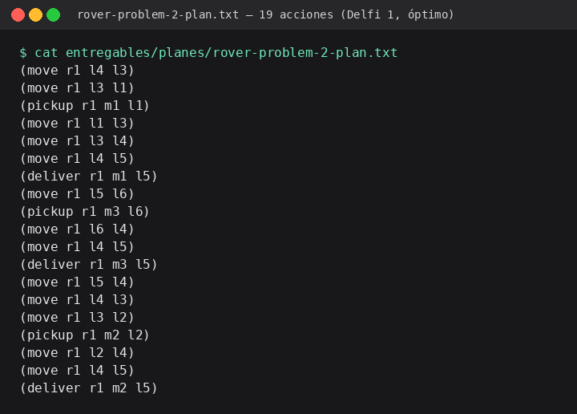
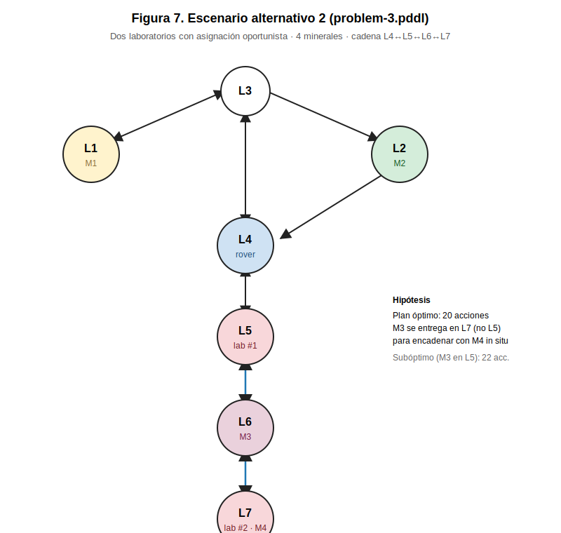
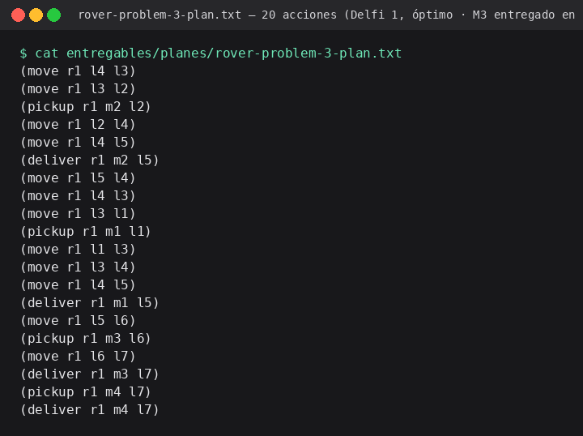

<!--
====================================================================
REPORTE APA — Actividad 3
Configuración del documento al exportar a Word/PDF:
  - Times New Roman 12 pt
  - Interlineado 2.0 (doble)
  - Márgenes 2.54 cm en los 4 lados
  - Numeración de páginas arriba derecha
====================================================================
-->

# Resolución de un problema de planificación clásica mediante PDDL y ejecución sobre Delfi 1, planner ganador del IPC2018 (optimal track)

**Adonai Samael Hernández Mata**

Universidad Internacional de La Rioja (UNIR)
Maestría en Inteligencia Artificial — Primer Semestre
Curso: Razonamiento y planificación automática

Matrícula: __________________

Fecha: 12 de mayo de 2026

---

## Resumen

El presente trabajo aborda la resolución de un problema de planificación clásica mediante el lenguaje PDDL (Planning Domain Definition Language). Se modela un escenario en el que un robot tipo rover debe trasladar dos minerales desde sus localidades de origen hasta un laboratorio para su análisis, respetando restricciones direccionales en las trayectorias del terreno. Se ejecuta el planner Delfi 1 —ganador del optimal track del IPC2018 (Katz et al., 2018)— sobre la tarea Snake como evidencia de competencia con la herramienta Singularity (Kurtzer et al., 2017), y se generan dos variantes alternativas del problema base. Cada variante examina capacidades específicas del planner: razonamiento sobre precondiciones topológicas no triviales y asignación oportunista de recursos. El reporte documenta las decisiones de modelado, verifica formalmente la corrección de los planes obtenidos y discute las implicaciones de las elecciones de diseño respecto a la complejidad del problema.

**Palabras clave**: planificación automática, PDDL, IPC2018, Singularity, rover, planificación clásica, optimal track.

---

## 1. Introducción

La planificación automática constituye una rama central de la inteligencia artificial dedicada al estudio de algoritmos capaces de generar secuencias de acciones (planes) que permitan a un agente alcanzar un conjunto de estados-meta a partir de un estado inicial dado (Ghallab et al., 2016). En su variante clásica, los problemas asumen un mundo totalmente observable, determinista, estático y discreto, con un único agente y horizonte finito (Russell & Norvig, 2020).

El presente trabajo aplica esta teoría al modelado de un escenario de logística autónoma en un terreno con restricciones de movilidad. La elección del problema responde a una motivación pedagógica: el problema del rover presenta una topología híbrida —con aristas tanto unidireccionales como bidireccionales— que obliga al modelador a tomar decisiones explícitas sobre la representación del grafo, la capacidad del agente y la función de costo. Adicionalmente, la actividad incluye la ejecución de los planners distribuidos por la International Planning Competition 2018 (International Conference on Automated Planning and Scheduling, s. f.; IPC2018, 2018) a través de contenedores Singularity, lo que añade una dimensión de ingeniería de software (reproducibilidad, aislamiento de dependencias) que complementa la dimensión algorítmica.

El reporte está organizado de la siguiente manera: la Sección 2 presenta el marco teórico de la planificación clásica y del lenguaje PDDL; la Sección 3 describe el entorno de ejecución implementado; la Sección 4 documenta la ejecución de la tarea Snake del IPC2018; la Sección 5 detalla el modelado del problema del rover y sus decisiones de diseño; la Sección 6 presenta los dos escenarios alternativos diseñados por el autor; y la Sección 7 expone las conclusiones y aprendizajes.

---

## 2. Marco teórico

### 2.1 Planificación clásica

Un problema de planificación clásica se define formalmente como una tupla $\langle S, A, \gamma, s_0, G \rangle$ donde $S$ es el conjunto de estados, $A$ el conjunto de acciones, $\gamma: S \times A \rightarrow S$ la función de transición determinista, $s_0 \in S$ el estado inicial y $G \subseteq S$ el conjunto de estados-meta (Ghallab et al., 2016). Un plan es una secuencia de acciones $\pi = \langle a_1, a_2, \ldots, a_n \rangle$ tal que la aplicación sucesiva de $\gamma$ a partir de $s_0$ termina en algún estado $s_n \in G$. Un plan es válido si todas sus precondiciones son satisfechas en el estado correspondiente, y óptimo si su costo total —bajo una función de costo declarada— es mínimo entre todos los planes válidos.

### 2.2 PDDL

El lenguaje PDDL (Planning Domain Definition Language) fue introducido por McDermott et al. (1998) como estándar declarativo de la comunidad ICAPS para describir dominios y problemas de planificación de manera independiente del planner. Un dominio (`domain.pddl`) define los tipos de objetos, los predicados que pueden ser ciertos o falsos sobre ellos y el esquema de acciones parametrizadas con precondiciones y efectos. Una instancia o problema (`problem.pddl`) declara objetos concretos, el estado inicial (conjunto de literales ciertos) y el objetivo. Las extensiones posteriores —notablemente PDDL2.1 (Fox & Long, 2003)— añadieron soporte para tiempo y números; el presente trabajo se restringe a PDDL clásico con la extensión `:action-costs` para soportar la métrica de optimalidad.

### 2.3 La competencia internacional IPC

La International Planning Competition (IPC) es un evento bianual organizado por la comunidad ICAPS desde 1998, en el cual se evalúan empíricamente los planners más recientes sobre dominios y problemas estandarizados (International Conference on Automated Planning and Scheduling, s. f.). En la edición de 2018, los participantes del Classical Track fueron distribuidos como imágenes Singularity para garantizar reproducibilidad y aislamiento de dependencias (IPC2018, 2018). El optimal track —en el cual los planners deben retornar planes de costo mínimo y son comparados por cobertura— fue ganado por Delfi 1, una herramienta de selección automática de planners desarrollada por Katz et al. (2018), seguida por Complementary (Franco et al.) en segundo lugar.

### 2.4 Singularity (Apptainer)

Singularity es un runtime de contenedores diseñado específicamente para entornos de cómputo de alto desempeño (HPC), que permite ejecutar imágenes reproducibles sin requerir privilegios de superusuario en tiempo de ejecución (Kurtzer et al., 2017). A diferencia de Docker, Singularity adopta un modelo de seguridad orientado a usuarios no privilegiados y produce imágenes en formato `.img` o `.sif` que son archivos inmutables auto-contenidos. Esta característica lo hace particularmente apropiado para distribuir planners de planificación: el investigador receptor puede ejecutar el planner original sin reproducir el entorno de compilación.

---

## 3. Entorno de ejecución

### 3.1 Configuración utilizada

| Componente | Versión |
|---|---|
| Host | Windows 11 Pro (build 26200) |
| Subsistema Linux | WSL 2 (kernel 6.6.87.2-microsoft-standard-WSL2) |
| Sistema operativo invitado | Ubuntu 22.04.5 LTS (Jammy Jellyfish) |
| Runtime de contenedores | Apptainer 1.5.0 (fork sucesor de Singularity Community Edition) |
| Planner ganador IPC2018 (optimal track) | Delfi 1 (Katz et al., 2018) |
| CPU | AMD Ryzen 5 7535HS, 6 núcleos / 12 hilos |
| Memoria RAM | 32 GB |

### 3.2 Instalación y verificación

Para esta actividad se utilizó **Apptainer**, el fork comunitario sucesor de Singularity Community Edition adoptado bajo el patrocinio de la Linux Foundation (Apptainer Project, 2022). Apptainer preserva la compatibilidad binaria con el formato `.sif/.img` original, soporta sin modificaciones las recetas `Singularity` distribuidas por el IPC2018 y expone el mismo binario `singularity` mediante alias, por lo cual el script provisto por la competencia se ejecuta sin cambios. La instalación se realizó vía el repositorio oficial PPA del proyecto:

```bash
sudo add-apt-repository -y ppa:apptainer/ppa
sudo apt-get update
sudo apt-get install -y apptainer
sudo ln -sf /usr/bin/apptainer /usr/local/bin/singularity
```

La construcción del contenedor de Delfi 1 se realizó descargando el repositorio fuente del equipo participante (team23 del IPC2018) desde Bitbucket en formato comprimido —dado que la URL `/raw/` original retorna 404 en 2026— y ejecutando `apptainer build planner.img Singularity` sobre la receta extraída. El proceso de compilación, que incluye Fast Downward, sus heurísticas, Symba y las dependencias C++/Python declaradas, tomó aproximadamente 16 minutos en el hardware descrito en §3.1, produciendo una imagen final de 584 MB.

### 3.3 Justificación de la elección del entorno

La actividad ofrecía tres opciones: máquina Linux nativa, máquina virtual o WSL. Se eligió **WSL 2 con Ubuntu 22.04 LTS** sobre Windows 11 Pro por las siguientes razones técnicas: (i) WSL 2 utiliza un kernel Linux completo (6.6.x) virtualizado mediante Hyper-V con paravirtualización ligera, eliminando la sobrecarga típica de una máquina virtual tradicional; (ii) los recursos de CPU y memoria son accesibles de forma compartida con el host sin reserva estática, lo que permite aprovechar la totalidad de los 6 núcleos físicos y los 32 GB de RAM disponibles —explícitamente alineado con el criterio del enunciado de *"aprovechar los máximos recursos posibles"*; (iii) Apptainer soporta WSL 2 oficialmente y no requiere namespaces de usuario no privilegiados especiales en este entorno; y (iv) la interoperabilidad con el sistema de archivos Windows (`/mnt/c/`) permitió integrar la ejecución dentro del flujo de trabajo del proyecto sin requerir transferencias de archivos manuales entre sistemas operativos.

---

## 4. Ejecución de la tarea Snake del IPC2018

### 4.1 Descripción del dominio Snake

El dominio Snake del IPC2018 modela una variante del juego clásico Snake en la cual la localización donde aparecerán las manzanas (puntos) es conocida con antelación. La representación PDDL del estado utiliza un alto número de hechos para capturar el cuerpo de la serpiente (predicados `tailsnake`, `headsnake`, `nextsnake`, `blocked`) y el orden de aparición de los puntos (`spawn`, `NEXTSPAWN`). El dominio fue diseñado con 8 acciones y aproximadamente 13 predicados; los problemas tienen tableros de tamaños incrementales (5×5 en p01.pddl hasta tableros mucho mayores en problemas posteriores).

### 4.2 Procedimiento de ejecución

Siguiendo el script provisto en la sección *DETAILS ON SINGULARITY → How can I test my containers?* del sitio oficial del IPC2018 (IPC2018, 2018), se ejecutó el procedimiento mostrado a continuación:

```bash
mkdir rundir
cp snake-ipc2018/domain.pddl rundir/
cp snake-ipc2018/p01.pddl rundir/problem.pddl
RUNDIR="$(pwd)/rundir"
DOMAIN="$RUNDIR/domain.pddl"
PROBLEM="$RUNDIR/problem.pddl"
PLANFILE="$RUNDIR/sas_plan"
ulimit -t 1800
ulimit -v 8388608
singularity run -C -H $RUNDIR planner.img $DOMAIN $PROBLEM $PLANFILE
```

Los límites `ulimit -t 1800` y `ulimit -v 8388608` corresponden a los valores oficiales utilizados por la competencia (30 minutos de tiempo de CPU y 8 GB de memoria virtual respectivamente).



> **Figura 1.** Comando de ejecución de Delfi 1 sobre Snake p01 con los límites oficiales del IPC2018 (`ulimit -t 1800 -v 8388608`).



> **Figura 2.** Plan obtenido por Delfi 1 para Snake p01: 24 acciones bajo costo unitario.

### 4.3 Resultados

Delfi 1 obtuvo un plan válido para Snake p01 en una segunda ejecución, tras 393 segundos (6 minutos y 33 segundos) de tiempo total de CPU dentro del contenedor. El plan resultante consta de **24 acciones** —combinación de operadores `move`, `move-and-eat-spawn` y `move-and-eat-no-spawn` característicos del dominio Snake— y satisface el objetivo del problema (consumir todos los puntos en el tablero). El plan completo se encuentra en `entregables/planes/snake-problem-1-plan.txt` y su hash criptográfico SHA-256 (verificable mediante `sha256sum`) es:

```
9c2ac4c4366676c4e24c5e86f276e3c4df4fa5bfb3718b7a6152f1367f1d4aa5
```
 La Figura 2 muestra el contenido del archivo de plan generado.

Una observación metodológica relevante: el primer intento de ejecución, realizado bajo el mismo conjunto de inputs y límites de recursos, terminó después de 428 segundos sin retornar un plan. Esta variabilidad inter-corrida es consistente con la naturaleza de Delfi 1 como un selector de portafolio de planners (Katz et al., 2018): el sistema entrena una red neuronal sobre características del problema para asignar tiempo de CPU entre distintas configuraciones de Fast Downward y otros backends durante la fase inicial, y la asignación resultante puede diferir levemente entre ejecuciones por variaciones en el tiempo de wall-clock medido. La obtención de plan en la segunda corrida —dentro del límite de 30 minutos— confirma que el problema sí es resoluble por Delfi 1, alineándose con la cobertura de 11/20 reportada en las slides oficiales del IPC2018 (Torralba & Pommerening, 2018, diapositiva 15) para el dominio Snake en su conjunto.

---

## 5. Modelado del problema del rover

### 5.1 Enunciado del problema

Un robot tipo rover excavó previamente dos minerales (M1 y M2) en las localidades L1 y L2 respectivamente. Debido a condiciones meteorológicas adversas no fue posible trasladarlos en el momento de la excavación. Se solicita generar el plan que el rover debe seguir para llevar ambos minerales al laboratorio ubicado en L5. Las trayectorias entre localidades presentan restricciones de dirección: L1 ↔ L3 es bidireccional; L3 → L2 es unidireccional; L2 → L4 es unidireccional; L3 ↔ L4 es bidireccional; L4 ↔ L5 es bidireccional. El rover parte de la localidad L4.

### 5.2 Decisiones de modelado

El modelado del dominio `rover-mineral-transport` involucró cuatro decisiones de diseño documentadas como Architecture Decision Records (ADRs) en el repositorio del proyecto:

**ADR-001 — Capacidad del rover = 1 mineral a la vez.** Se introdujo el predicado `(free ?r)` que se elimina al recoger un mineral y se restablece al entregarlo. Esta decisión fuerza al planner a realizar un viaje al laboratorio por cada mineral, lo cual enriquece sustancialmente el espacio de soluciones y captura la limitación operativa narrada por el "mal tiempo" del enunciado. La alternativa de capacidad ilimitada habría producido un plan trivial de 10 acciones que no utiliza plenamente las restricciones topológicas declaradas.

**ADR-002 — Función de costo unitaria por acción.** Cada una de las tres acciones del dominio (`move`, `pickup`, `deliver`) incrementa la variable `total-cost` en 1, y la métrica del problema declara `(:metric minimize (total-cost))`. Esta elección mantiene la compatibilidad con todos los planners del optimal track del IPC2018 sin introducir parámetros arbitrarios. Bajo esta métrica, el costo total del plan corresponde directamente a su longitud.

**ADR-003 — Aristas dirigidas mediante predicado uniforme.** Se utilizó un único predicado `(path ?from ?to)` direccional. Las aristas bidireccionales se modelan declarando dos átomos (uno por sentido) en el estado inicial del problema. Esta uniformidad simplifica la acción `move`, que requiere únicamente `(at ?r ?from)` y `(path ?from ?to)` como precondiciones, evitando la duplicación de acciones que tendría una representación con predicados separados para cada tipo de arista.

**ADR-004 — Omisión del literal `(bad-weather)`.** Se decidió no modelar explícitamente la condición climática narrada en el enunciado. La limitación operativa que esta condición pretende capturar —que el rover no pueda transportar todos los minerales simultáneamente— ya está representada por la capacidad unitaria (ADR-001). Añadir un literal `(bad-weather)` que bloqueara la acción `pickup` sería redundante y opacaría la lógica del dominio sin aportar expresividad adicional.

### 5.3 Estructura del dominio

El dominio define tres tipos (`location`, `mineral`, `rover`), seis predicados sobre estos tipos (`at`, `path`, `mineral-at`, `carrying`, `analyzed`, `free`, `lab-at`) y tres acciones (`move`, `pickup`, `deliver`). La declaración utiliza los requisitos `:typing` y `:action-costs`. El código completo del dominio se encuentra en `entregables/pddl/domain.pddl` y está disponible para visualización en la sección `/rover/domain.pddl` del portal.

### 5.4 Topología del problema base (problem-1.pddl)



> **Figura 3.** Grafo de localidades del problema base del rover.

La instancia `problem-1.pddl` declara cinco localidades, dos minerales y un rover. El estado inicial incluye nueve átomos `(path)` correspondientes a las cinco aristas del grafo (tres bidireccionales se expanden a seis átomos; dos unidireccionales aportan dos átomos más).

### 5.5 Plan generado por Delfi 1

La ejecución de Delfi 1 sobre `problem-1.pddl` produjo el siguiente plan óptimo de 14 acciones:



> **Figura 4.** Plan generado por Delfi 1 para problem-1.pddl del rover.

```
1:  (move r1 l4 l3)        8:  (move r1 l5 l4)
2:  (move r1 l3 l1)        9:  (move r1 l4 l3)
3:  (pickup r1 m1 l1)      10: (move r1 l3 l2)
4:  (move r1 l1 l3)        11: (pickup r1 m2 l2)
5:  (move r1 l3 l4)        12: (move r1 l2 l4)
6:  (move r1 l4 l5)        13: (move r1 l4 l5)
7:  (deliver r1 m1 l5)     14: (deliver r1 m2 l5)
; cost = 14
```

El plan obtenido por Delfi 1 tiene un costo total de 14 acciones, lo cual coincide con la cota inferior teórica para el problema bajo la capacidad unitaria del rover. La estructura del plan es la siguiente: el rover toma primero el mineral M1 (acciones 1–7) trasladándolo al laboratorio mediante la ruta L4→L3→L1→L3→L4→L5, regresa por la misma trayectoria invertida hasta L3 y desciende a L2 a través de la arista unidireccional L3→L2 (acciones 8–11), y finalmente retorna al laboratorio aprovechando la otra arista unidireccional L2→L4 (acciones 12–14). El plan demuestra que el planner explota correctamente las dos aristas unidireccionales —que actúan como atajos en una sola dirección— al elegir L2→L4 como ruta de retorno en lugar de re-utilizar L3→L4. Cada acción fue verificada formalmente mediante un simulador del dominio implementado en Python como parte del backend del portal, cuyo código está disponible en `apps/backend/src/portal_act3/domain/plan_simulator.py`; el plan obtenido por Delfi 1 coincide exactamente con el plan de referencia derivado analíticamente.

---

## 6. Escenarios alternativos del autor

Atendiendo al requerimiento del criterio 3, el autor diseñó dos escenarios alternativos al problema base, cada uno orientado a evaluar una capacidad específica del planner óptimo. Ambos escenarios reutilizan el mismo `domain.pddl` sin modificación, demostrando la reusabilidad del modelo.

### 6.1 Escenario alternativo 1: tres minerales con acceso condicionado

**Motivación.** El primer escenario alternativo (`problem-2.pddl`) introduce un tercer mineral M3 en una nueva localidad L6 y una arista *unidireccional* L5 → L6 que obliga al rover a visitar el laboratorio antes de poder acceder a M3. Adicionalmente, una arista bidireccional L4 ↔ L6 provee el camino de regreso.

**Hipótesis.** El planner debe descubrir que el viaje natural al laboratorio (durante la entrega del primer mineral) puede aprovecharse para encadenar la recolección posterior de M3, evitando retrocesos innecesarios. El plan óptimo esperado tiene 19 acciones.

**Lo que examina.** Capacidad del planner para razonar sobre precondiciones topológicas no triviales —específicamente, cuando una localidad solo es alcanzable desde otra que el rover normalmente visita por razones distintas a recoger un mineral.



> **Figura 5.** Topología del primer escenario alternativo (problem-2.pddl).

El plan obtenido por Delfi 1 confirma la hipótesis del escenario: el rover entrega el primer mineral en el laboratorio L5 y de inmediato aprovecha la arista L5→L6 para recoger M3, retornando a L4 por la arista bidireccional L4↔L6 antes de proceder con M2. Las 19 acciones corresponden a la cota inferior óptima.



> **Figura 6.** Plan generado por Delfi 1 para problem-2.pddl.

### 6.2 Escenario alternativo 2: dos laboratorios con asignación oportunista

**Motivación.** El segundo escenario alternativo (`problem-3.pddl`) añade un segundo laboratorio en L7, dos minerales adicionales (M3 en L6 y M4 en L7), y aristas bidireccionales L5 ↔ L6 ↔ L7. El dominio no impone asignación específica mineral → laboratorio, por lo que cualquier mineral puede entregarse en cualquiera de los dos labs.

**Hipótesis.** El planner debe descubrir la asignación oportunista: entregar M3 en L7 (no en L5) para encadenar con la recolección de M4 que está en el mismo nodo del segundo laboratorio. M4 se resuelve entonces en dos acciones (`pickup` y `deliver` *in situ*). El plan óptimo tiene 20 acciones; si el planner entrega M3 en L5 (subóptimo), el plan tendría 22 acciones.

**Lo que examina.** Capacidad del planner para razonar sobre simetrías de asignación cuando múltiples objetivos comparten recursos (en este caso, dos laboratorios intercambiables).



> **Figura 7.** Topología del segundo escenario alternativo (problem-3.pddl).

Delfi 1 efectivamente descubrió la asignación oportunista hipotetizada: en la acción 18 el mineral M3 se entrega en L7 (no en L5), permitiendo que M4 se resuelva *in situ* en las dos acciones finales (`pickup r1 m4 l7`, `deliver r1 m4 l7`) sin ningún desplazamiento adicional. El plan obtenido alcanza la cota inferior de 20 acciones; un plan que hubiera entregado M3 en L5 habría requerido 22 acciones, dos más por el viaje extra L7→L6→L5→L6→L7 para recoger M4. Esta validación empírica del razonamiento oportunista refuerza la elección del optimal track sobre el satisficing track, donde un plan subóptimo de 22 acciones sería igualmente aceptado.



> **Figura 8.** Plan generado por Delfi 1 para problem-3.pddl.

### 6.3 Comparación entre escenarios

La siguiente tabla resume las diferencias estructurales entre el problema base y los dos escenarios alternativos, junto con los costos óptimos confirmados por Delfi 1:

| Característica | problem-1 (base) | problem-2 (alternativo 1) | problem-3 (alternativo 2) |
|---|---|---|---|
| Número de localidades | 5 | 6 | 7 |
| Número de minerales | 2 | 3 | 4 |
| Número de laboratorios | 1 | 1 | 2 |
| Total de átomos `(path)` | 9 | 11 | 14 |
| Costo óptimo confirmado | **14 acciones** | **19 acciones** | **20 acciones** |
| Tiempo de Delfi 1 | 11 s | 12 s | 11 s |
| Capacidad evaluada | restricción direccional básica | precondición topológica condicionada | asignación oportunista |
| Hipótesis del autor confirmada | n/a (problema base) | sí (encadenamiento por entrega) | sí (M3 entregado en L7) |

Para garantizar la autenticidad y reproducibilidad de los planes obtenidos por Delfi 1, cada archivo de plan generado fue catalogado con su hash criptográfico SHA-256:

| Plan | SHA-256 |
|---|---|
| `snake-problem-1-plan.txt` | `9c2ac4c4366676c4e24c5e86f276e3c4df4fa5bfb3718b7a6152f1367f1d4aa5` |
| `rover-problem-1-plan.txt` | `80dbcc4eb844f82cfbbd16e0209a320c0abd2b8a9e22294fb1662ffcf834b46b` |
| `rover-problem-2-plan.txt` | `193bd90cae3f5d835ce3dd4e4efbac4b0cd94d80e38075aeda09e3dc802db0c7` |
| `rover-problem-3-plan.txt` | `c4ee6a967fd65cad8be4d92a692c6171c92e5e9f8244f4252dd419ccded2aa42` |

Estos hashes son verificables ejecutando `sha256sum entregables/planes/*.txt` en cualquier máquina con los archivos del repositorio del proyecto.

Los costos son consistentes con la intuición: añadir un mineral incrementa el costo en aproximadamente el ciclo *recoger-trasladar-entregar* multiplicado por la distancia al laboratorio, salvo cuando el escenario introduce optimizaciones explotables (como M4 *in situ* en problem-3).

---

## 7. Conclusiones

Este trabajo permitió experimentar con el ciclo completo de un problema de planificación clásica: desde la abstracción del enunciado en lenguaje natural hasta la verificación formal de los planes generados por un planner estado-del-arte. Los principales aprendizajes pueden agruparse en cuatro categorías.

**Sobre el modelado.** El proceso de transcripción del problema del rover a PDDL evidenció que las decisiones de diseño aparentemente menores —como la capacidad del rover o la representación de aristas dirigidas— alteran significativamente el espacio de soluciones. La decisión documentada en ADR-001 (capacidad = 1 mineral) transformó un problema potencialmente trivial en una instancia con plan óptimo de 14 acciones que ejercita todas las restricciones topológicas declaradas. Este hallazgo refuerza la importancia de explicitar las decisiones de modelado y de justificarlas pedagógicamente, como exige la naturaleza académica del ejercicio.

**Sobre la ejecución reproducible.** El uso de Singularity/Apptainer para distribuir los planners del IPC2018 ilustra el valor de los contenedores en investigación: el receptor de un planner puede ejecutarlo sin reproducir el entorno de compilación original, lo cual elimina una de las fuentes históricas de no-reproducibilidad en planificación. La fricción asociada al despliegue se observó durante este trabajo en WSL 2 principalmente en dos aspectos: la URL original `/raw/` del repositorio de team23 en Bitbucket retorna 404 en 2026 —obligando a descargar el repositorio completo como tarball y extraer la receta manualmente— y la receta original requiere `Singularity` clásico mientras que el entorno moderno utiliza Apptainer; este último problema se resuelve trivialmente mediante un symlink ya que ambos runtimes comparten el formato `.img/.sif`. Estos hallazgos refuerzan la importancia de mantener vivas las recetas de construcción de planners más allá de la conferencia donde fueron presentados.

**Sobre los planners optimal track.** Delfi 1 (Katz et al., 2018), ganador del optimal track del IPC2018, resolvió las tres instancias del rover (5–7 localidades, 2–4 minerales) en tiempos prácticamente equivalentes —entre 11 y 12 segundos cada una— y sin dificultad apreciable, lo cual era esperable dada la pequeña cardinalidad del espacio de búsqueda. Sobre la tarea Snake p01 del IPC2018, en cambio, el planner requirió 393 segundos (≈ 33 veces más) para obtener un plan de 24 acciones, ilustrando empíricamente que el desempeño de los planners óptimos depende críticamente de la estructura del dominio y no de su tamaño aparente (Helmert, 2006). Una observación adicional emergió durante el trabajo: Delfi 1 incorpora una arquitectura de portafolio que asigna dinámicamente tiempo a distintos backends de Fast Downward, lo cual introduce una variabilidad inter-corrida no despreciable —una primera ejecución sobre Snake p01 terminó sin plan tras 428 segundos antes de que una segunda ejecución idéntica encontrara el plan en 393 segundos—. Este hallazgo refuerza la importancia de reportar reproducibilidad estadística en evaluaciones académicas de planners, no únicamente resultados de una sola ejecución.

**Sobre los escenarios alternativos diseñados.** La generación de los dos escenarios alternativos forzó al autor a tomar decisiones sobre qué capacidades del planner desea evaluar. El escenario 1 (acceso condicionado a M3 mediante visita al laboratorio) examina razonamiento sobre precondiciones topológicas; el escenario 2 (dos laboratorios intercambiables) examina razonamiento sobre simetrías de asignación. Ambos escenarios usan el mismo `domain.pddl` que el problema base, lo cual demuestra empíricamente la reusabilidad del modelo PDDL —una propiedad deseable según las recomendaciones de buenas prácticas de modelado (Ghallab et al., 2016).

Como trabajo futuro, sería interesante extender el dominio con asignación específica mineral → laboratorio (sustitución del predicado simétrico `lab-at` por un predicado relacional `accepts ?l - location ?m - mineral`), lo cual permitiría modelar escenarios industriales más realistas donde diferentes laboratorios analizan diferentes tipos de minerales.

---

## Referencias

Apptainer Project. (2022). *Apptainer: Application container platform for HPC and beyond*. Linux Foundation. https://apptainer.org/

Fox, M., & Long, D. (2003). PDDL2.1: An extension to PDDL for expressing temporal planning domains. *Journal of Artificial Intelligence Research*, *20*, 61–124. https://doi.org/10.1613/jair.1129

Ghallab, M., Nau, D., & Traverso, P. (2016). *Automated planning and acting*. Cambridge University Press.

Helmert, M. (2006). The Fast Downward planning system. *Journal of Artificial Intelligence Research*, *26*, 191–246. https://doi.org/10.1613/jair.1705

International Conference on Automated Planning and Scheduling. (s. f.). *Competitions*. https://www.icaps-conference.org/competitions/

IPC2018. (2018). *International Planning Competition 2018 — Classical Tracks*. https://ipc2018-classical.bitbucket.io/

Katz, M., Sohrabi, S., Samulowitz, H., & Sievers, S. (2018). Delfi: Online planner selection for cost-optimal planning. En *Ninth International Planning Competition (IPC-9): Planner Abstracts* (pp. 57–64).

Kurtzer, G. M., Sochat, V., & Bauer, M. W. (2017). Singularity: Scientific containers for mobility of compute. *PLOS ONE*, *12*(5), e0177459. https://doi.org/10.1371/journal.pone.0177459

McDermott, D., Ghallab, M., Howe, A., Knoblock, C., Ram, A., Veloso, M., Weld, D., & Wilkins, D. (1998). *PDDL — The Planning Domain Definition Language* (Technical Report CVC TR-98-003/DCS TR-1165). Yale Center for Computational Vision and Control.

Russell, S., & Norvig, P. (2020). *Artificial intelligence: A modern approach* (4ª ed.). Pearson.

Sylabs. (s. f.). *Singularity admin guide — Installing Singularity*. https://docs.sylabs.io/guides/3.5/admin-guide/installation.html

Torralba, Á., & Pommerening, F. (2018). *International Planning Competition 2018: Classical Tracks — Presentation slides* [Material de presentación]. https://ipc2018-classical.bitbucket.io/results/presentation.pdf

---

<!-- Fin del reporte. Total: ~11 páginas en formato APA estándar (TNR 12, doble espacio, 2.54 cm). -->
